# KERO installation guide

This guide provides information on how to set up your KERO cluster and configure it to be ready to serve users.

## Requirements

Each machine of a KERO cluster should meet the following minimum requirements:

* 4 GB RAM
* 2 cores and 64-bits processor
* A debian based OS with systemd

Additionally, all cluster nodes have to be configured and joined to the same network.

## Installing the first machine

To bring up the first node of the KERO cluster, copy the contents of the KERO installer on the desired machine and just run the `installation.sh` script providing `first` as argument. This is, run `bash installation.sh first` on the first KERO node.

Please note that you will need an internet connection during the installation process.

The installation script will start, and perform the following operations:
* Set up a `KERO_HOME` environment variable, with the location where you copied the KERO installer.
* Install and configure Docker, etcd and Kubernetes.
* Generate a `cache` folder with a secret token and some scripts to join the KERO cluster. **Important**: please copy this `cache` directory on the installation folder of all nodes you want to join the KERO cluster.
* Pull all Docker images used by the various provided services.
* Set up all KERO commands (by copying them to the `/usr/local/sbin` folder).

After the installation completes, you should be able to see the first node as the only member of the cluster by running `kubectl get nodes` with the same user which installed KERO.

## Installing master nodes


## Installing slave nodes


## Setting up storage

To set up the storage provisioner for the first time, invoke the command `deploy-glfs` from any machine on the KERO cluster.
 
This script takes the _number of replicas_ and the _number of bricks per node_ as arguments:

* _number of replicas_: Determines how many copies of every file are going to be distributed across the cluster.
* _number of bricks per node_: Determines how many glusterfs bricks are available to use on every node.

An example usage of the script is:
```
node-1$ deploy-glfs 3 3
```

`deploy-glfs` does the following Kubernetes operations:
* Label the storage nodes with `storagenode=glusterfs`. By default, every node in the cluster is a storage node.
* Create a DaemonSets, which instantiates a GlusterFS server on every storage node.
* Execute `gluster peer probe` from and against every storage node.
* Create the StorageClass for GlusterFS with every node's `brickrootPaths`.
* Bind the necessary ServiceAccount / ClusterRole
* Create a GlusterFS simple provisioner

## Configuring LDAP and user credentials

With your shared storage already setted, you can now deploy the users administration service based on OpenLDAP. In order to do that, simply run the `deploy-ldap` command on any machine with kubectl support.

The `deploy-ldap` script can optionally take the desired LDAP server IP as argument (it defaults to 10.96.100.100).

Once deployed, you will be able to visit the admin panel of the LDAP server on the IP informed by the script. The homepage should be like the following:

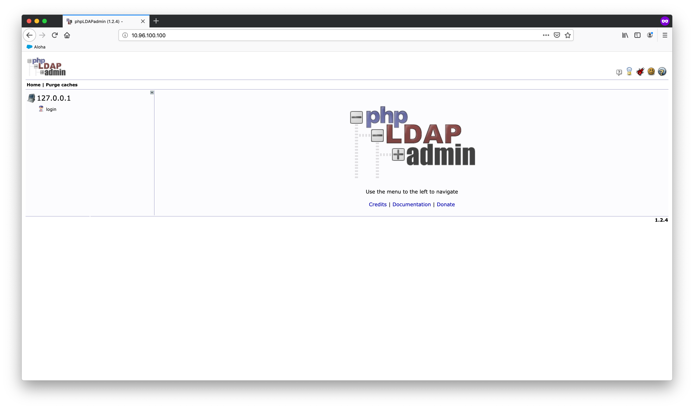

To manage your KERO cluster users, first click _login_ on the admin panel.

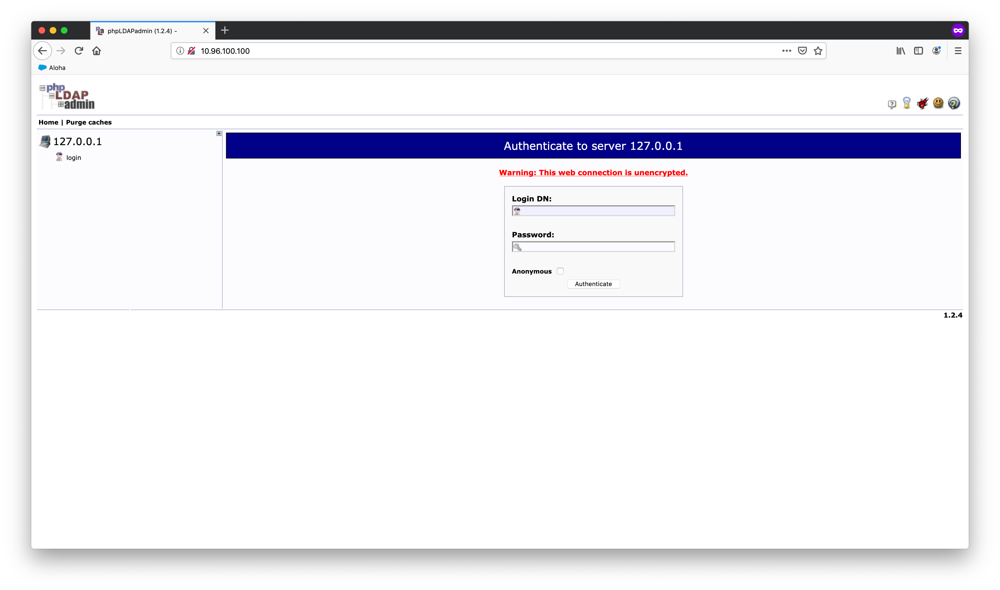

After entering your administrator full DN (the one you specified during the KERO installation) and password, you should be successfully logged in into the admin panel.

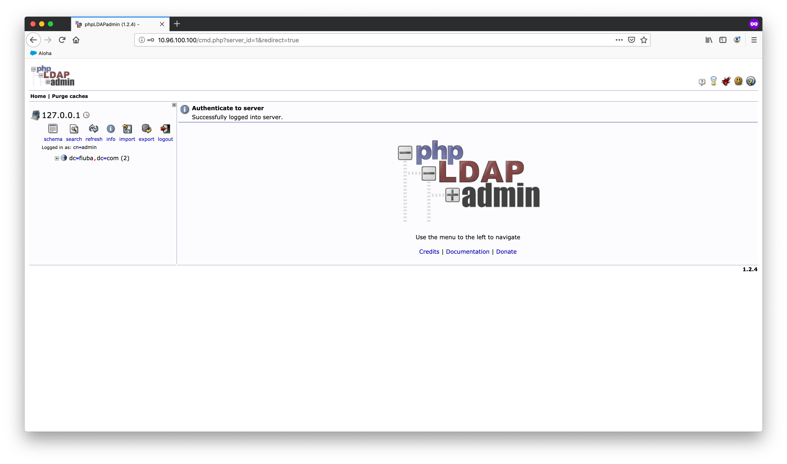

By clicking the _import_ icon, you will be able to import new LDAP entries by either specifying some .ldif file on your machine or pasting its contents.

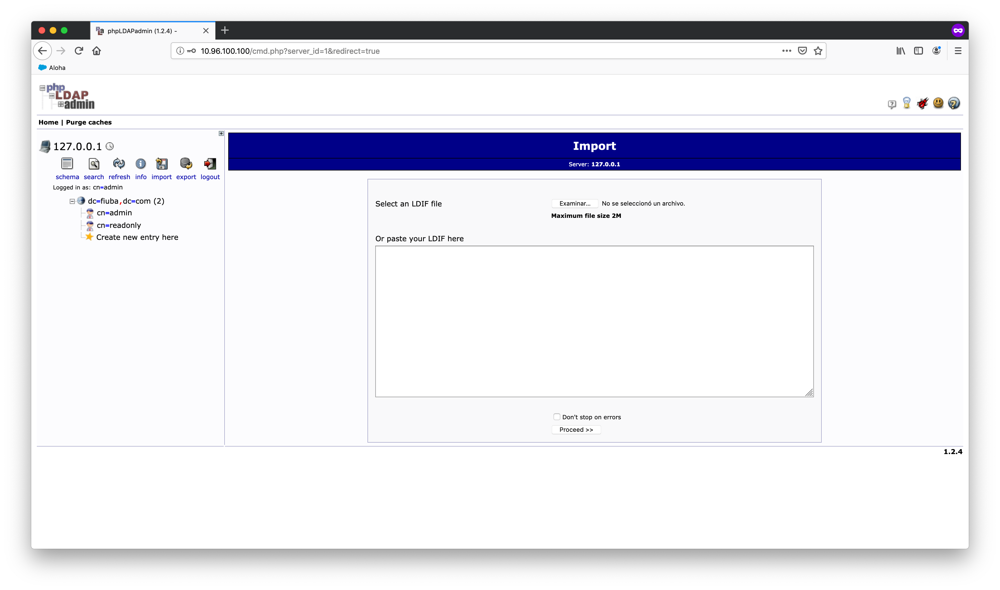

After importing your data, click on _Proceed_.

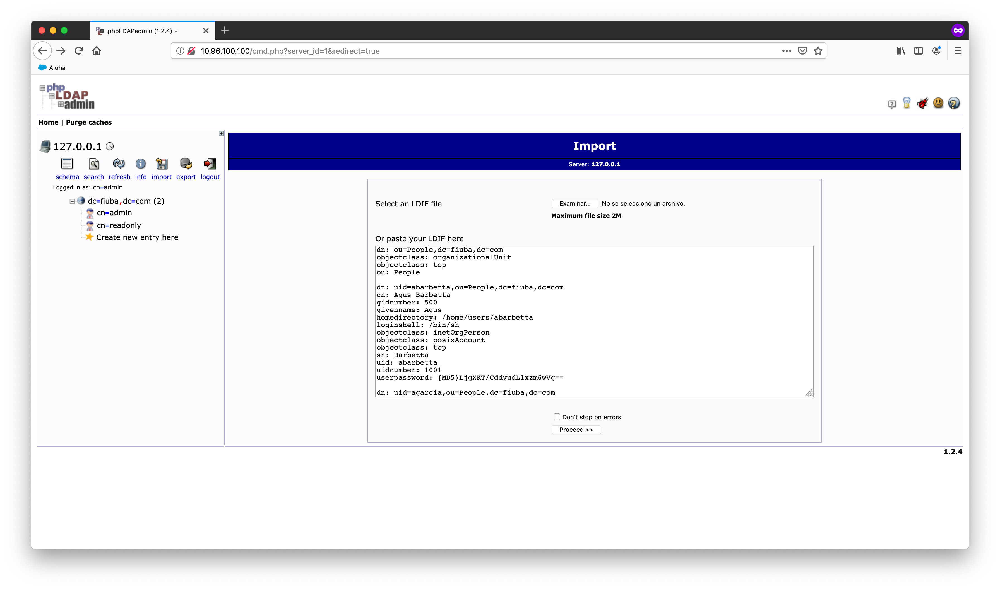

If no errors were present on the .ldif file, the new entries should all be created successfully:


Alternatively, you can manually add new LDAP entries by clicking on the _Create new entry here_ button on the left menu.

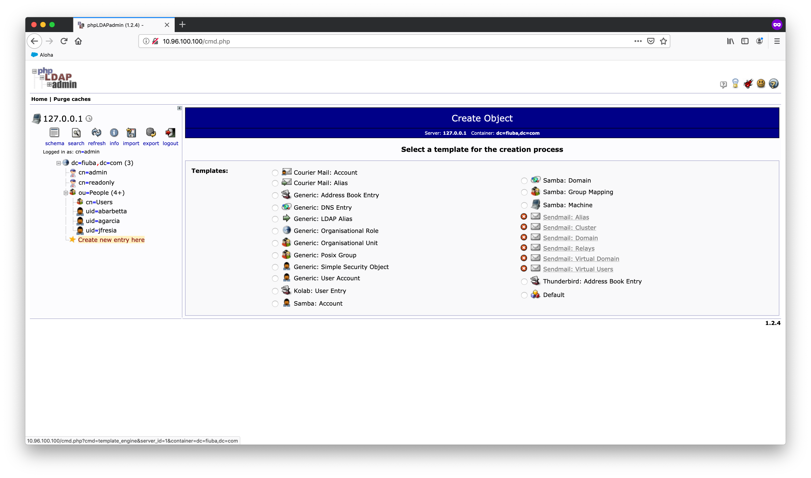

For instance, for adding a new user choose _Generic: User Account_. A form like the following should appear:

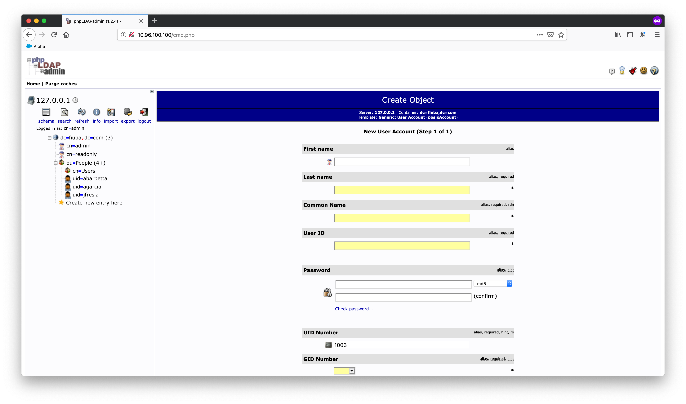

After completing the whole form with your new user information, select _Create Object_. Please note that you will have to provide your final users their new user ID and password, so do not lose them.

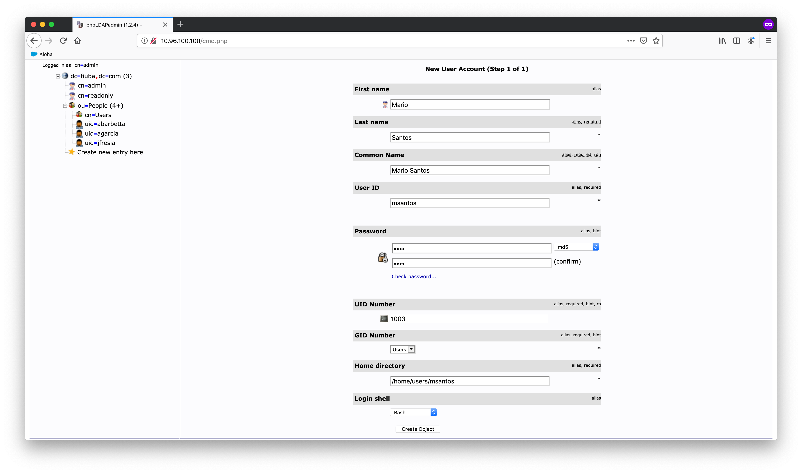

Review the new user information and click on _Commit_:

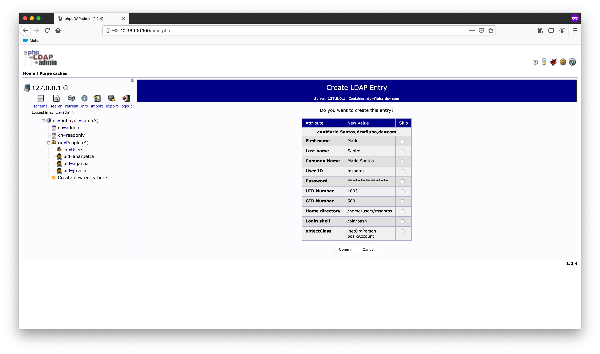

For viewing or editing the newly created used, simply click it on the left menu tree.

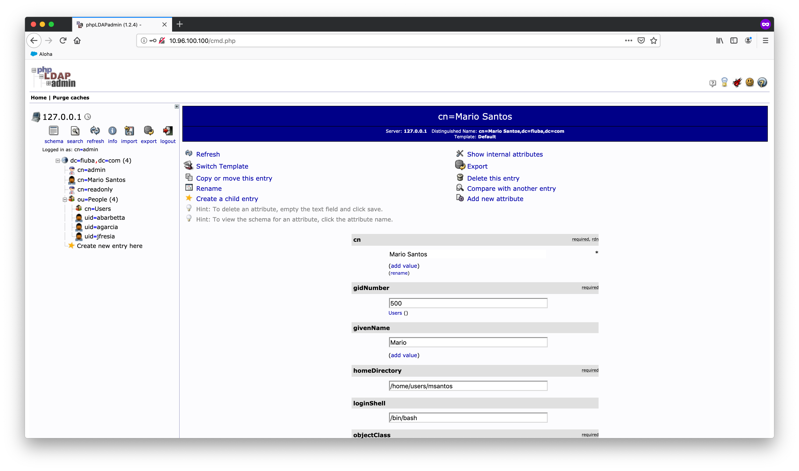

If you want to delete some user, after selecting it on the left menu tree click on _Delete this entry_. A confirmation box will appear. Click on _Delete_.

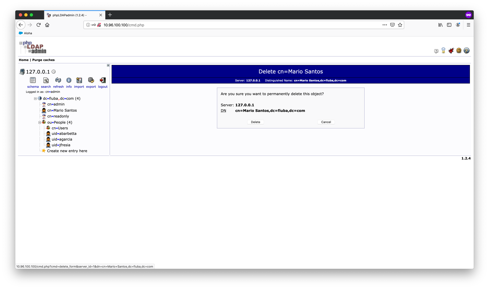

A success message should appear and the user should be deleted.

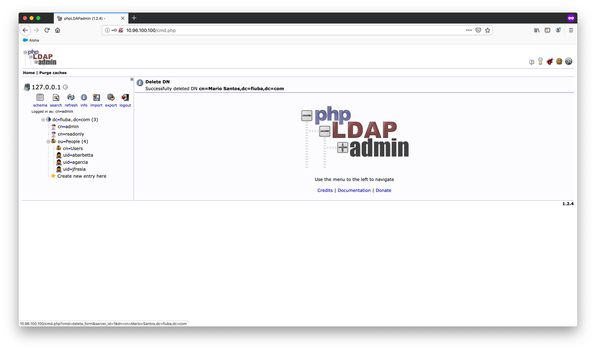

## Monitoring your cluster

An additional monitoring service is provided via the Kubernetes Web UI Dashboard. In order to set up this dashboard, simply run the `deploy-dashboard` command. 

The `deploy-dashboard` script can optionally take the desired dahsboard server IP as an argument (it defaults to 10.96.111.111).

After being deployed, you can check the monitoring dashboard on the IP provided by the script. Please note that you may need to add some exception rule in your browser for a self-signed SSL certificate.

If you find some box like the following, simply select _SKIP_:

** --- PLACEHOLDER --- **

Once on the dashboard, you can monitor all pods, services and deployments on the KERO cluster.

** --- PLACEHOLDER --- *

## Remote desktop service

To enable the remote desktop service, you will need a service that deploys vnc desktops on demand. The Desktop spawner API provides endpoints to deploy and destroy a vnc server remotely. To deploy the desktop spawner API from a Kero cluster machine just invoke the command `deploy-desktop-spawner`.

`deploy-desktop-spawner` does the following Kubernetes operations:
* Creates a Deployment, which instantiates a Desktop spawner API server on a node.
* Waits for the desktop spawner API server to be running and ready.
* Return the new desktop spawner service IP.
