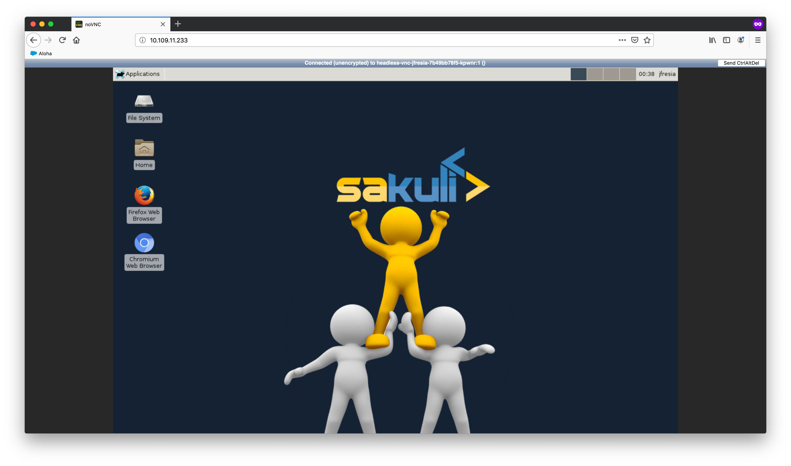

# User guide to KERO

This guide is aimed for KERO final users and provides information on how to access and use the different services provided.

## Remote desktop service

### Login in and accessing a desktop

_Make sure your desktop is already deployed in the KERO cluster and ready to use_

To login to your desktop, follow these steps:
1. Navigate to _TODO_ 

2. Enter your password

### How to use personal and shared storage

TODO

### Accessing the cluster from outside

TODO

### Logout

TODO
