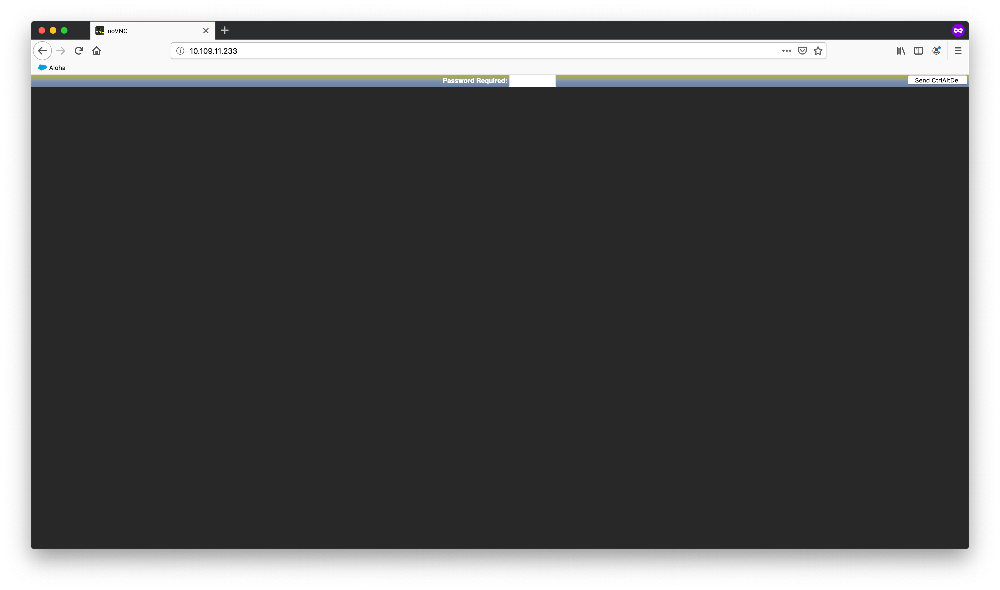

# User guide to KERO

This guide is aimed for KERO final users and provides information on how to access and use the different services provided.

## Remote desktop service

### Create your desktop

To create your desktop, execute the command `deploy-vnc-server` with your `<your-VNC-username>`.

### Login in and accessing a desktop

_Make sure your desktop is already deployed in the KERO cluster and ready to use_

To login to your desktop, follow these steps:
1. Navigate to _TODO_ 

2. Enter your password


### Destroy your desktop

When you are done using your desktop, execute the command `destroy-vnc-server` with your `<your-VNC-username>`.

### How to use personal and shared storage

* Your **personal storage** is located under _/home/users/`<your-VNC-username>`/_ 
* The **shared storage** is located under _/mnt/shared/_

Feel free to save your personal data on your **personal storage**, and communal data on **shared storage**.

Every other directory is ephemeral storage. This means that data saved outside personal or shared storage will not be persisted on desktop reboot.

### Accessing the cluster from outside

To access to your desktop from an outside computer, follow these steps:
1. Do a POST against the desktop spawner service at _TODO/desks_ with the following body: 
```
{
    "user": "<your-vnc-username>",
    "password": "<your-vnc-password>"
}
```

For example:
```
curl  -X POST _TODO_ -d '{"user": "abarbetta", "password": "password"}' -H "Content-Type: application/json"
```

or use the script `vnc-connect` providing the desktop spawner url and your credentials.

2. Navigate to the url the desktop spawner gave you to login and use your desktop
3. When you are finished, do a DELETE against the desktop spawner (also with your credentials) to shutdown your desktop. You can also opt to use the script `vnc-disconnect` providing the desktop spawner url and your credentials.